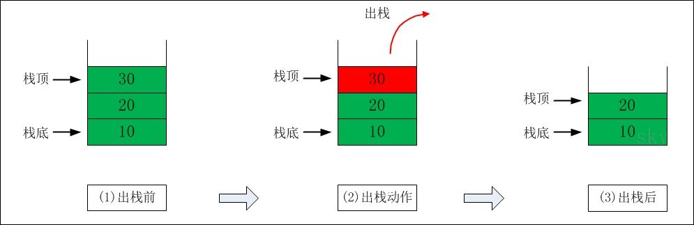
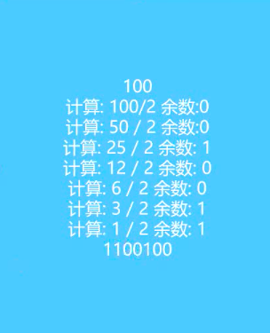

# 认识栈结构
1. 栈也是一种非常常见的数据结构，并且在程序中应用广泛
2. 数组
- 我们知道数组是一种**线性结构**，并且可以在数组的**任意位置**插入和删除数据
- 但是有时候，我们为了实现某些功能，必须对这种**任意性**加以限制
- 而**栈和队列**就是比较常见的**受限的线性结构**
# 栈结构示意图

# 栈（stack），它是一种受限的线性表，**后进先出（LIFO）**
- 其限制是仅允许在**表的一端**进行插入和删除运算。这一端被称之为**栈顶**，相对的，把另一端叫做**栈底**。
- LIFO（last in first out）表示后进入的元素，第一个弹出栈空间
- 向一个栈插入新元素又称作**进栈** **入栈** 或 **压栈**，它是把新元素放在栈顶元素的上面，使之成为新的栈顶元素；
- 从一个栈中删除元素又叫做**出栈或者是退栈**，它是把栈顶元素删除掉，使其相邻的元素成为新的栈顶元素
# 程序中栈的应用
- 函数调用栈
# 栈结构面试题
- 有六个元素6，5，4，3，2，1的顺序进栈，问下面哪一个不是合理的出栈序列c
1. (5，4，3，6，2，1）
2. （4，5，3，2，1，6）
3. ～～（3，4，6，5，2，1）～～
4. （2，3，4，1，5，6）
# 栈结构的实现
1. 实现栈结构的两种常见方式
- 基于数组
- 基于列表
2. 链表也是一种数据结构，但是js中没有自带链表结构
3. 常用操作
- push(element):添加一个新元素到栈顶
- pop():移除栈顶元素，同时返回被移除的元素
- peek():返回栈顶元素，不对栈做任何操作
- isEmpty():如果栈里面没有任何元素，则返回true,否则返回false
- size():返回栈内元素的个数，该方法和数组的length属性相似
- toString(): 将栈结构的内容以字符形式返回
# 用数组实现栈
```javascript
// 封装栈类
function Stack() {
    // 栈的属性
    this.items = [];
    // 栈的相关操作
    // 1、将元素压入栈
    Stack.prototype.push = function(element) {
        this.items.push(element)
    }
    // 2、从栈顶取出元素
    Stack.prototype.pop = function() {
        return this.items.pop();
    }
    // 3、查看栈顶元素
    Stack.prototype.peek = function() {
        return this.items[this.items.length - 1]
    }
    // 4、判断栈是否为空
    Stack.prototype.isEmpty = function() {
        return this.items.length === 0
    }
    // 5、栈内元素个数
    Stack.prototype.size = function() {
        return this.items.length;
    }
    // 6、toString
    Stack.prototype.toString = function() {
        var result = ''
        for(var i = 0; i< this.items.length; i++) {
            result += this.items[i] + ''
        }
        return result;
    }
}
// 栈的使用
var s = new Stack();
s.push(1);
s.push(2);
s.push(3);
s.push(4);
alert(s);
s.pop();
s.pop();
alert(s);
```

# 十进制转二进制
1. 为什么需要十进制转二进制
- 现实生活中我们主要使用十进制
- 但在计算科学中，二进制非常重要，因为计算机里的所有内容都是用二进制数字表示的（0 和 1）
- 没有十进制和二进制的转化，与计算机难以交流
2. 如何实现十进制转二进制
- 可以将十进制数字和2整除（二进制是满二进一），直到结果是0为止


# 十进制转二进制函数实现
```javascript
function dec2bin(decNumber) {
    // 1、定义栈对象
    var stack = new Stack();
    // 2、循环操作
    while(decNumber > 0) {
        // 2.1取余数，并且放入栈中
        stack.push(decNumber % 2);
        // 2.2获取整除后的结果，成为下一次运行的数字
        decNumber = Math.floor(decNumber / 2);
    }
    // 3、从栈中取出0和1
    var binaryStr = '';
    while(!stack.isEmpty) {
        binaryStr += stack.pop();
    }
    return binaryStr;
}
```
